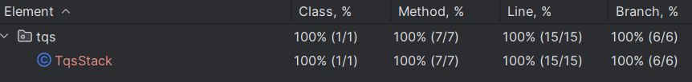
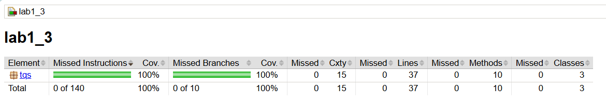

# LAB1

## lab1_1
```
Produção vs testes
- Código de produção: src/main/java
- Testes: src/test/java
Maven separa código de produção e código de teste para facilitar compilação e execução de testes. Não tem main.

Comandos: 
mvn test -> executa todos os testes JUnit
mvn clean -> limpa a pasta target/
mvn dependency:tree -> exibe árvore de dependências do projeto
mvn clean test package -> limpa, testa e gera o pacote .jar

As divisões ou aproximações dos números pode ser feito de maneira a definir um delta, desvio.
```

## lab1_2
```
Desabilitar testes = menos código executado = menor cobertura.
Número de linhas: ignora linhas em branco, {}, //, anotações, linhas em branco...
Line coverage - marca cada linha de código executável.
Se inicialização do campo está embutida no construtor - não conta, fora - conta.
Line % = linhas executadas/linhas totais de código * 100
Branch coverage - em cada decisão (if, else, switch, ?:, while…), identifica todos os caminhos possíveis.

f-g) Tanto os meus testes manuais quanto os gerados por ChatGpt atingiram 100% de cobertuta de linhas, métodos e branches da classe TqsStack. Algum código de IA é mais claro e automatizado. Mas a cobertura não reflete a qualidade dos testes. 

h) Cobertura continua a 100%

i) Mesmo que os testes atuais passem e cobrem todas as linhas, alguns scenário podem quebrar o código na produção. Por exemplo, o TqsStack pode falhar se inserir o tamanho inválido do Stack, como 0, -1 e et ou se tentar introduzir os valores maiores do tamanho da pilha. Por isso, não se pode confiar apenas na cobertura para avaliar a qualidade do código. A validação devia ser incluída no código para poder ser considerada nos testes (assertThrows).

Formato dos asserts: 
assertTrue(condição true, mensagem de erro que será exibido se o resultado for false)
assertEquals(valor esperado, atual, mensagem de erro se não forem =)
assertThrows(tipo da exceção esperada, lambda expression ou method reference, que executa o código que deve lançar exceção, mensagem de falha que será exibido se a exceção não acontecer)
stack::peek - chamar o método peek no objeto stack, SÓ funciona se não houver os argumentos.
() -> service.method(arg) cria um lambda que só será executado dentro 
```


## lab1_3
```
a) As restrições a considerar: 
- Uma reserva por estudante e por turno; 
- Prazos de reserva(depois de um turno terminar, não é possível fazer a reserva para esse turno);
- Lotação máxima - se não haver lugares disponíveis a reserva não pode ser feita; 
- ticket é um qr code gerado aleatoriamente; 
- Validade temporal de reserva (o código só é válido para o dia e turno de reserva após este tempo fica expirado); 
- O código não pode ser usado mais que 1 vez; 
- Os bilhetes cancelados não podem ser usados; 
- O cancelamento só pode ser efetuado num determinado tempo (por exemplo 30 mins antes do início do turno);
- O sistema deve verificar se a reserva existe antes de cancela-la ou marcar como usada. 

d) O relatório gerado do jacoco mostrou a cobertura de instruções, decisões, métodos e classes de 100%. Isso significa que todos os métodos da classe MealsBookingService foram executados ao menos uma vez pelos testes e todos os caminhos de decisão foram cobertos. Mas pelo que observei mesmo com cobertura 100% alguns testes não validam o comportamento em todos os casos.

e) Ao fazer o mínimo de cobertura de 90% o meu build também passou porque tinha a cobertura 100%, mas se tentar desabilitar alguns testes, o build falha. 
```

